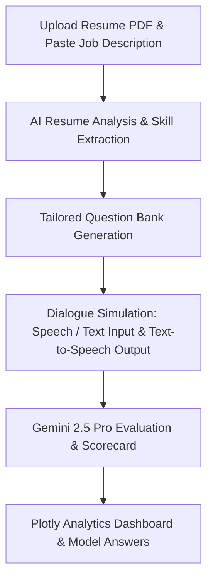

# AI Interview Preparation Platform 🎙️

An interactive, AI-powered mock interview preparation web application built with **Streamlit**, **Python**, and **Google Gemini API**. Candidates can practice resume-focused or role-specific interviews using text or voice recording, and receive comprehensive evaluations, model answers, and interactive performance analytics.

---

## 🚀 Key Features

- **Adaptive Difficulty Interviews**: Questions scale dynamically during the interview (Beginner ➡️ Intermediate ➡️ Advanced) based on your real-time answers. Track your progression via an interactive visual timeline!
- **Varied Question Matrix**: The AI dynamically cycles through Behavioral, Theoretical, Scenario-based, Project-related, and Algorithmic questions to simulate comprehensive human interviews.
- **AI Performance Dashboard & Scorecards**: Evaluates candidates across five detailed dimensions (Technical Skills, Communication, Confidence, Problem Solving, Overall Readiness) rendered beautifully on interactive Plotly radar charts.
- **Skill Gap Analysis & Learning Roadmap**: Generates a personalized breakdown of Strengths & Weaknesses alongside a tailored 4-week structured learning schedule to conquer your target role.
- **Speech-to-Text & AI Voice Assistant**: Record responses directly via browser audio inputs, transcribed by Gemini, and listen to the interviewer via local text-to-speech playback (`pyttsx3`).
- **Demo Mode & IDE Tuned**: Launch immediately without an API key using pre-loaded mock data. Includes built-in configurations (`.vscode/settings.json`, `pyrightconfig.json`) to eliminate VS Code false-positive warnings out-of-the-box.

---

## 🏗️ System Architecture & Workflow

The platform operates on a streamlined 4-step pipeline:



1. **Resume Processing**: The uploaded PDF is parsed using `pypdf`, extracting raw text from document pages.
2. **AI Analysis**: `gemini-2.5-flash` analyzes the resume text alongside target job criteria to extract key skills and draft a high-level experience profile.
3. **Dialogue & Session Management**: Streamlit manages session states for the interview loop. A dark glassmorphic styling system is injected using CSS. Custom audio recordings are transcribed using Gemini's native audio parsing.
4. **Grading & Evaluation**: At the end of the interview, the chat history is analyzed by `gemini-2.5-pro` to generate performance scores, a breakdown of strengths, growth areas, and suggested stellar answers.

---

## 📂 Project Structure

```
AI-Interviews-Preparation-Platform/
├── .vscode/              # Contains settings.json to optimize IDE linting
├── .env                  # Stores your private Google Gemini API Key
├── .env.example          # Template environment file
├── .gitignore            # Ensures virtual environments (.venv) and API keys are not pushed to Git
├── pyrightconfig.json    # Ignores .venv from static python analysis
├── README.md             # Project documentation (this file)
├── requirements.txt      # Python package requirements
├── app.py                # Main Streamlit application entrypoint (UI & page layout)
├── set_api_key.py        # Command-line utility to automatically configure your API key
└── utils/                # Helper utilities and modules
    ├── ai_helper.py      # Core Gemini API wrapper functions (questions, transcribing, grading, TTS)
    ├── css_styles.py     # High-end dark glassmorphic custom CSS injections
    └── resume_parser.py  # PDF text extraction wrapper using pypdf
```

---

## 🛠️ Tech Stack

- **Frontend/UI**: [Streamlit](https://streamlit.io/) (Python-based interactive web framework)
- **AI Core**: [Google Gemini API](https://ai.google.dev/) (`gemini-2.5-flash` for extraction & transcription, `gemini-2.5-pro` for evaluation)
- **Visualizations**: [Plotly](https://plotly.com/) (Interactive polar radar charts)
- **Audio Processing**: [pyttsx3](https://pypi.org/project/pyttsx3/) (Text-to-speech) & native audio browser interfaces
- **PDF Extraction**: [pypdf](https://pypi.org/project/pypdf/)

---

## ⚙️ Getting Started

### 1. Clone or Navigate to the Directory
Ensure you are in the project folder:
```bash
cd "d:\4-1 pdfs\Ai Interview"
```

### 2. Install Dependencies
Ensure you have Python 3.10+ installed. Install the required libraries in your environment:
```bash
pip install -r requirements.txt
```

### 3. Setup API Key
Create a `.env` file from the example:
```bash
cp .env.example .env
```
Open `.env` and fill in your `GEMINI_API_KEY`, or run the helper command to set it automatically:
```bash
python set_api_key.py YOUR_GEMINI_API_KEY
```

### 4. Run the Application
Start the Streamlit application:
```bash
streamlit run app.py
```
This will open the application in your default web browser at `http://localhost:8501`.


